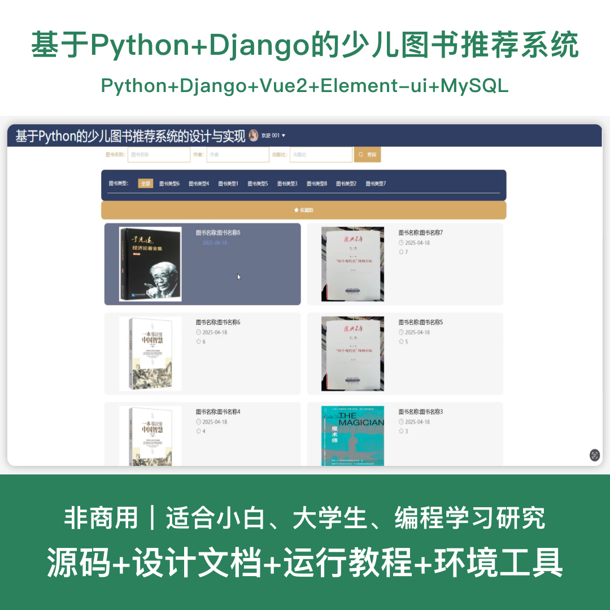
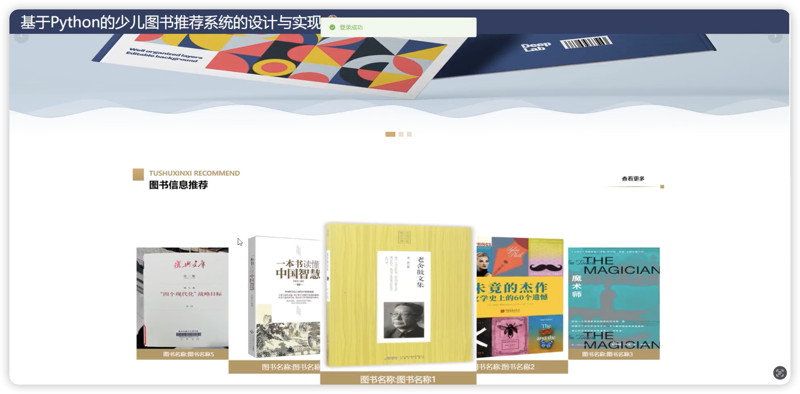
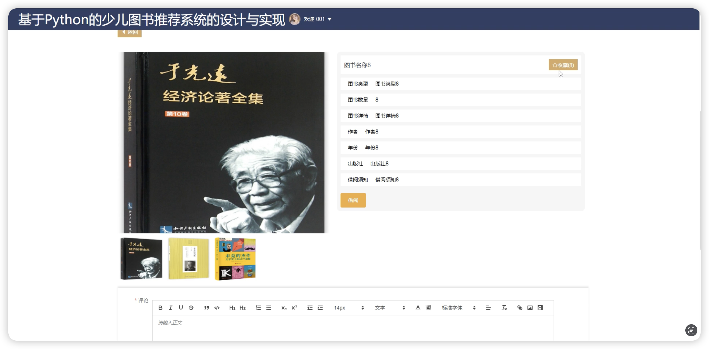
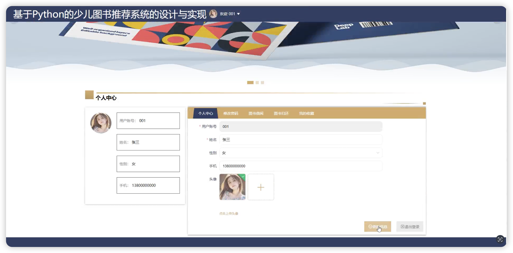
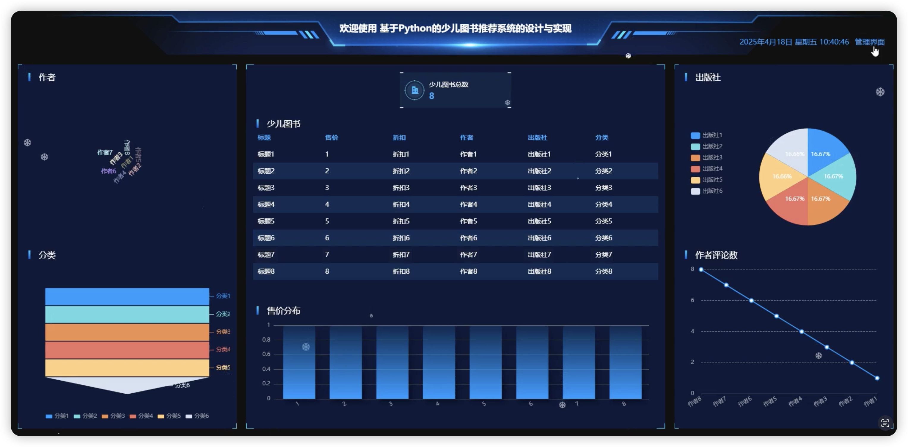
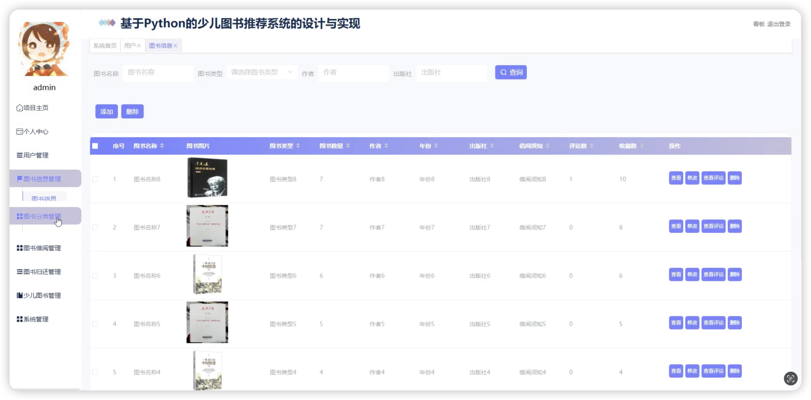
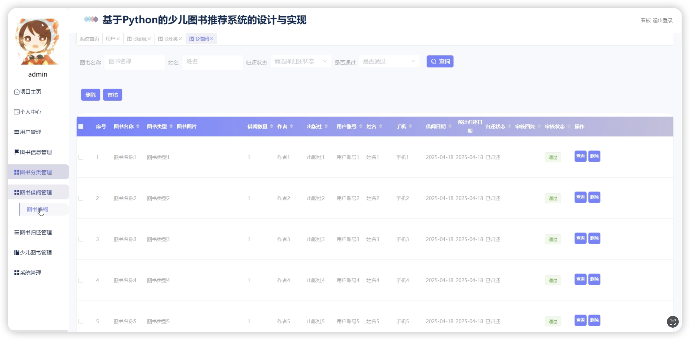
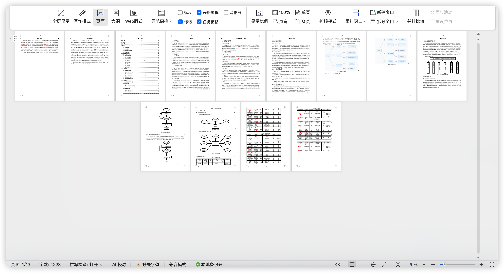

# python110D
python110D基于Python+Django的少儿图书推荐系统+LW
 
## 源码问题查看主页咨询

### 一、关键词
少儿图书推荐系统、儿童阅读系统、图书管理系统、阅读推荐平台、图书借阅系统

### 二、作品包含
源码+数据库+设计文档+全套环境和工具资源+本地部署教程

### 三、项目技术
前端技术：Html、Css、Js、Vue2.6、Element-ui

后端技术：Python、Django、PyMySQL

### 四、运行环境（以下版本亲测，其他版本兼容性请自行测试）
开发工具：PyCharm + VSCODE

数据库：MySQL 5.7+

数据库管理工具：Navicat10以上版本

环境配置软件：Python 3.x + Django

前端Nodejs：14+

浏览器：谷歌浏览器

### 五、项目介绍
项目编号：python110D

基于Python+Django的少儿图书推荐系统，为少儿用户提供个性化图书推荐服务，方便管理员进行图书管理和推荐维护，提升少儿阅读体验。

角色：管理员、用户

用户功能：注册登录、浏览图书、搜索查询、图书推荐、图书收藏、个人中心。

管理员功能：登录、用户管理、图书管理、图书分类管理、推荐管理、评论管理、系统管理。

数据库表：14个

### 六、运行截图

